# picklerick

Hello folks, I’m Yousef Elnagar AKA (MrDurdenEG)
a cybersecurity enthusiast and beginner CTF player
in this write-up I'll walk you through my journey solving the 'pickle rick' room
explaining my thought process and how I got the final ingredients

first i open the web application and i got this

i viewed the source-page

i got the username

Username: R1ckRul3s

i noticed that there a path named 'assets'
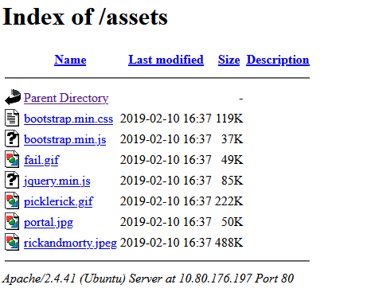
but i got nothing some images and scripts

try to open '/robots.txt' path

i got something not sure what's this but kept in my mind

Wubbalubbadubdub

then i try to fuzzing the URL

ffuf -u http://10.82.168.227/FUZZ -w /root/Desktop/Tools/wordlists/SecLists/Discovery/Web-Content/common.txt -e .php,.html,.txt -mc 200

-e .php,.html,.txt : to find the paths with those extension
-mc 200 : to filter the paths with response status = 200 (succeeded)

got those files : index.html , login.php , robots.txt

we already saw /robots.txt

index.html is the main page

when i access : http://10.82.168.227/login.php it shows this page

i tried the username i got
Username: R1ckRul3s
password : Wubbalubbadubdub
this password worked

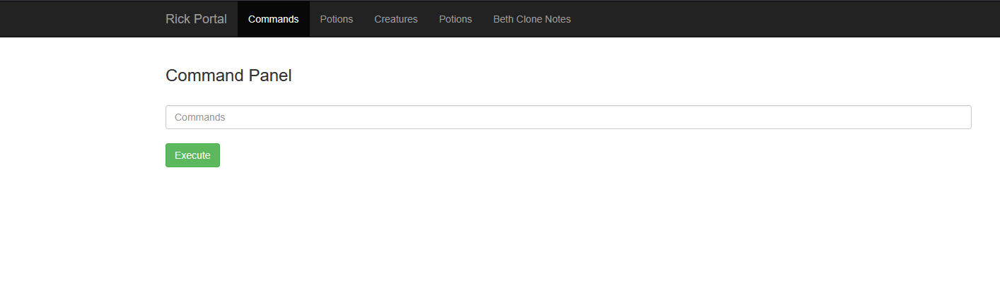

command panel

i tried some commands

ls -la
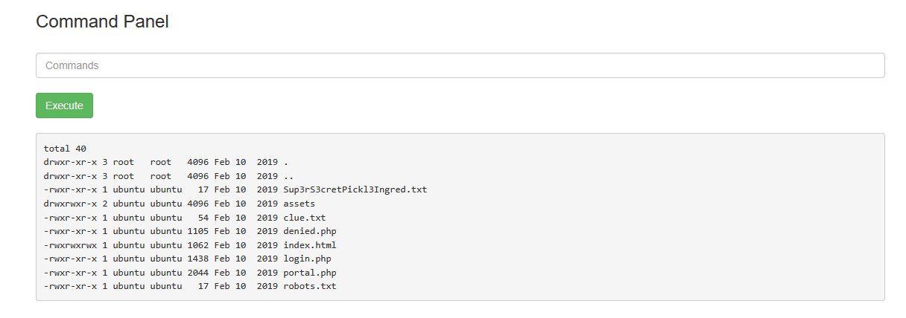

got some interesting files

Sup3rS3cretPickl3Ingred.txt
clue.txt

when i try to 'cat' those files and it was disabled

i accessed the files by put it as a path
http://10.82.168.227/Sup3rS3cretPickl3Ingred.txt
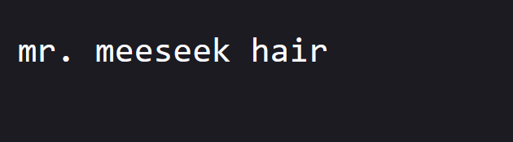
got first ingredient

http://10.82.168.227/clue.txt
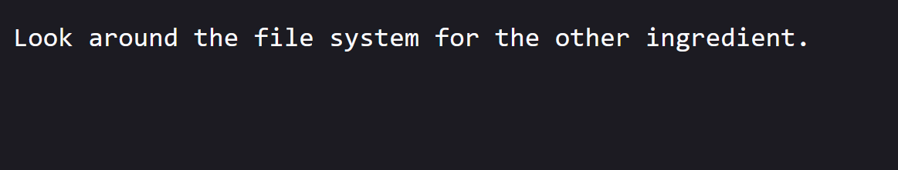
nothing important

i showed the source-page i got something
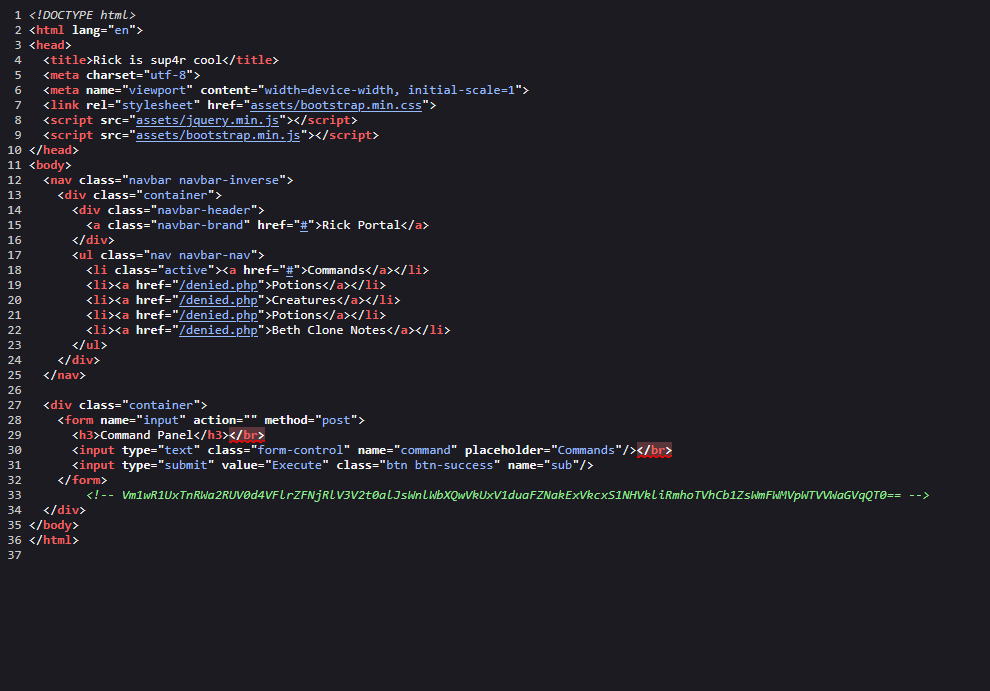

<!-- Vm1wR1UxTnRWa2RUV0d4VFlrZFNjRlV3V2t0alJsWnlWbXQwVkUxV1duaFZNakExVkcxS1NHVkliRmhoTVhCb1ZsWmFWMVpWTVVWaGVqQT0== -->

base64 decode
i decoded this string 6 times

finally i got something : rabbit hole
i can't use it anywhere

so i keep use command panel

i try to show working dir 'pwd'
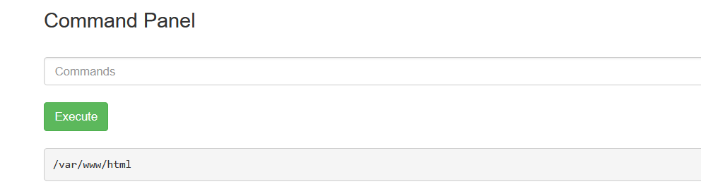

i got back to the root dir 'cd /../../ && ls -la' to list the dir
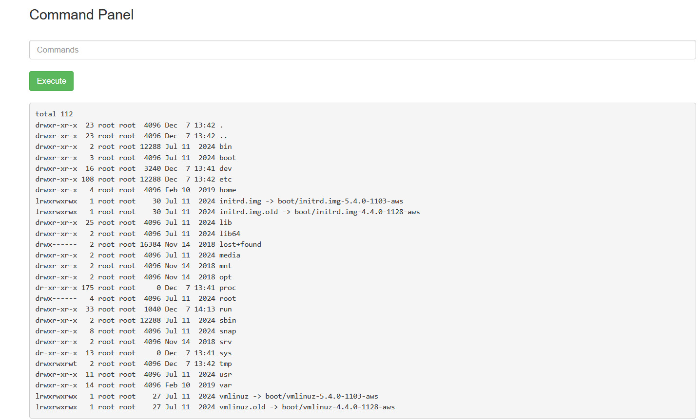

important directories (home, root)
lets see 'cd /home && ls -la'
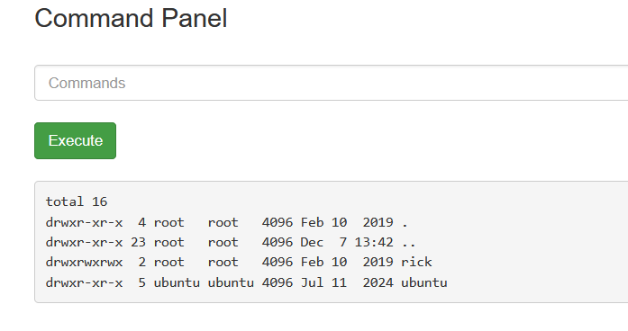

rick dir lets go through it 'cd /home/rick && ls -la'
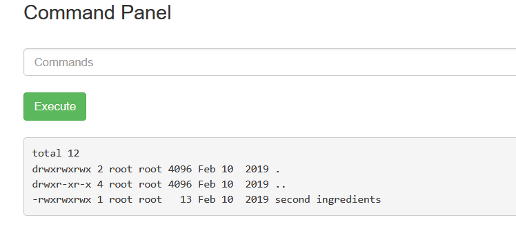
second ingredients hhhmmmmmmmm
but i cant use 'cat'
i try (cat,head ,tail,more) but all were disabled
but 'less' workeddd

less '/home/rick/second ingredients'
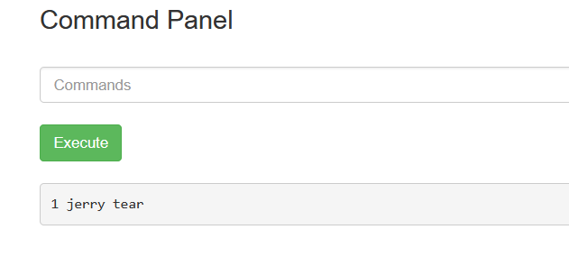

got the second ingredient : 1 jerry tear

lets now try the '/root' dir
i tried to list the dir but i cant , i noticed "drwx------ 4 root root 4096 Jul 11 2024 root"
the root is the only one who has permission lets try 'sudo'
'sudo ls -la /root'
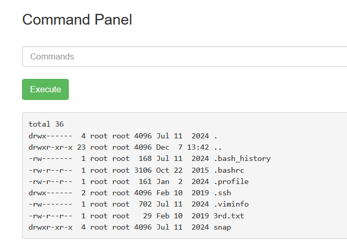
3rd.txt????? hhmmmm
'less /root/3rd.txt'
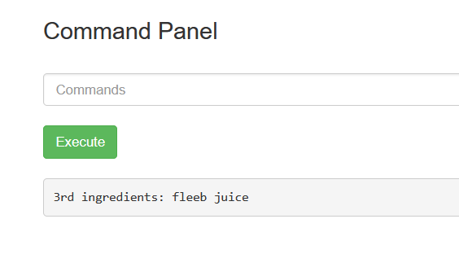
3rd ingredients: fleeb juice
